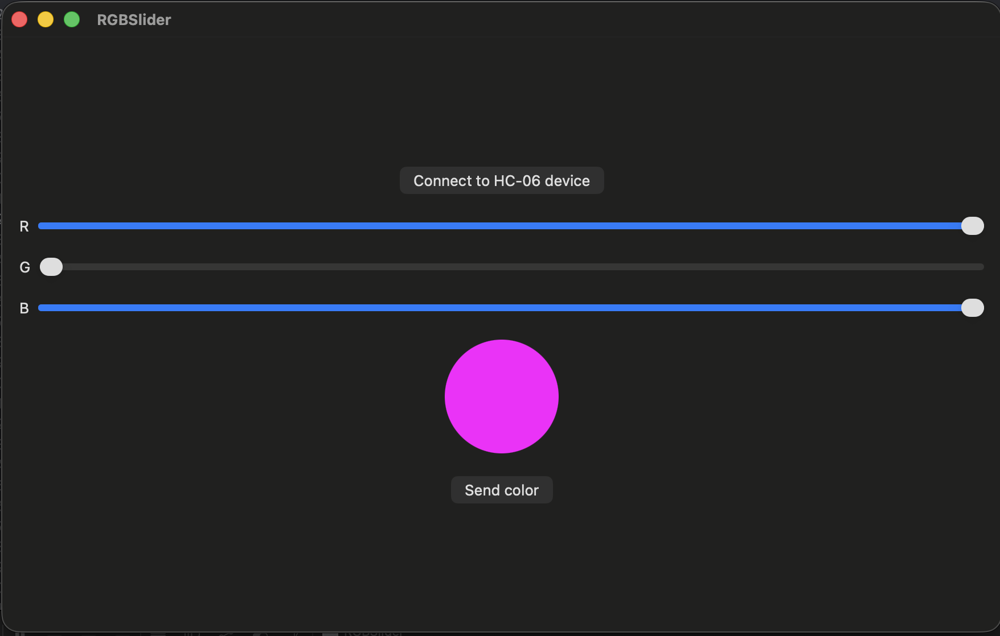

# RGBSlider - macOS App with bluetooth functionality

the project was build with the following:
- macOS 15+
- SwiftUI with `@StateObject` for state management
- IOBluetooth framework for classic Bluetooth (RFCOMM)
- Combine for reactive connection state
- HC-06 / BT04 Bluetooth module paired via System Settings
- Croduino-compatible microcontroller on the receiving end

Hardware communication:
- transport: Bluetooth Classic RFCOMM channel (ID 1)
- protocol: plain-text messages in the form `R<red>G<green>B<blue>\n`
- values: 0–255 per color channel

## ✨ Features of the Project

- Connect to a paired HC-06 / BT04 Bluetooth module with one tap
- Three sliders (R, G, B) ranging from 0 to 255
- Live color preview circle that updates as you drag the sliders
- Send the selected RGB color to the microcontroller over RFCOMM
- Async write on a background queue so the UI stays responsive
- Published `isConnected` state and logging for easy debugging

## 📸 Screenshots

  
  
  
  

